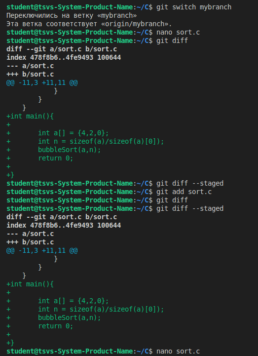
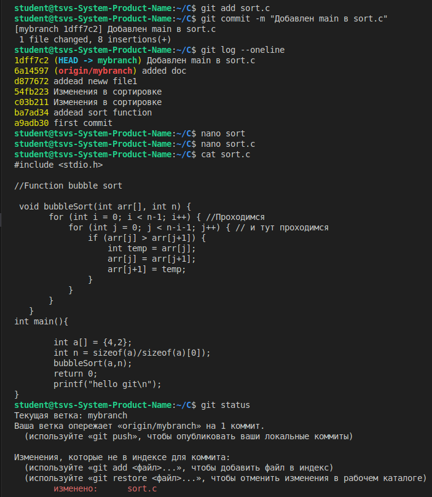
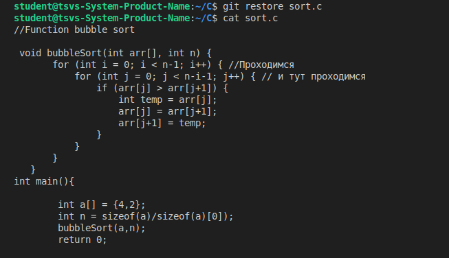
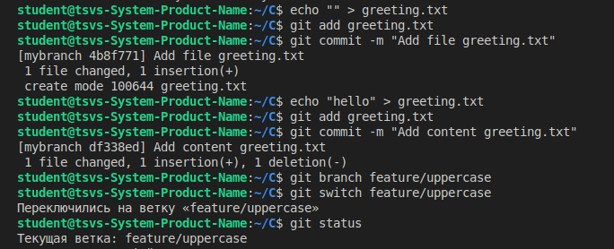
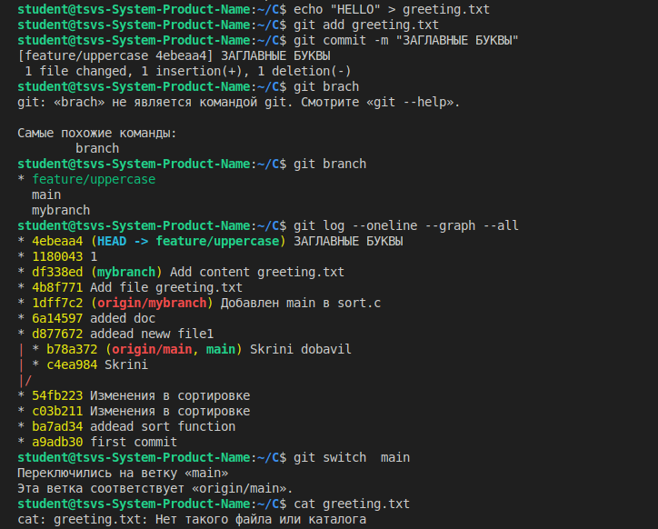
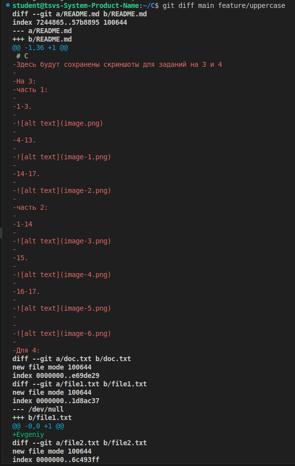

# C
Здесь будут сохранены скриншоты для заданий на 3 и 4

На 3:
часть 1:

1-3.

4-13.

14-17.

часть 2:

1-14

15.

16-17.

Для 4:
Первая часть.

1-8.

9-12.

13-14.

15-19.

20-21

22

23

Вторая часть.

1-5.

6-11.

12.

13-19.

